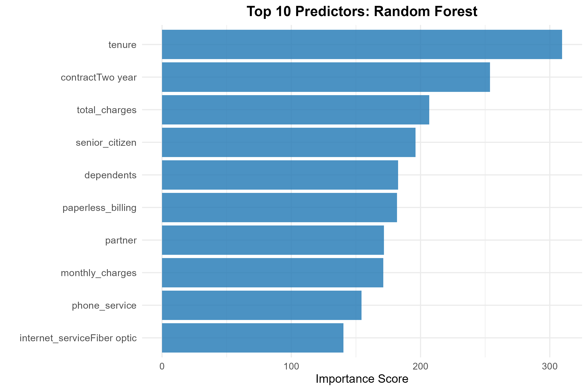

## TELCO CUSTOMER CHURN PREDICTION
This project builds a machine learning–powered churn detection system that identifies customers likely to leave — enabling proactive retention and revenue savings for a telecom company.

## 📊 Project Overview
Dataset: Telco Customer Churn (public, from Kaggle)
Goal: Predict customer churn and estimate retention-based revenue impact
Techniques Used:
- Data cleaning & feature engineering
- Class imbalance handling with ROSE
- Models: Logistic Regression, Random Forest, XGBoost
- Threshold tuning to optimize F1
- Evaluation: Confusion matrix, ROC/AUC, Precision–Recall

## ⚙️ Methodology
1. Data Preprocessing
- Cleaned missing values and corrected data types
- Encoded Yes/No → binary; other categoricals → factors
- Train/test split: 70/30
- Balanced the training set using ROSE (churn from 26% → ~50%)

2. Modeling
- Trained and evaluated three models: Logistic Regression, Random Forest and XGBoost
- Each model was tested across thresholds from 0.30 to 0.60 to maximize performance.

3. Evaluation Metrics
- Accuracy
- Precision
- Recall
- F1-score
- AUC (Area Under ROC Curve)

## ✅ Results
| Model               | Accuracy | Precision | Recall   | F1        | AUC       |
|----------------------|-----------|------------|----------|-----------|-----------|
| Logistic Regression  | 0.7355    | 0.5017     | 0.7825   | 0.6114    | 0.7505    |
| Random Forest        | 0.7445    | 0.5129     | 0.7825   | 0.6196    | 0.7567    |
| XGBoost              | 0.7336    | 0.4994     | 0.8021   | 0.6156    | 0.7555    |

## Takeaways:
- Random Forest delivered the strongest F1 and AUC
- XGBoost captured the most churners (highest recall → 80.2%)
  
## 💰 High-Risk Retention Impact
Using the optimized XGBoost threshold:
- High-risk customers flagged: 2,905
- Actual churners within that group: 1,499
- Precision: 51.6%
- Estimated retention success: 30%
- Customers saved: 450

## 💵 Financial Impact
- Annual revenue saved: $349,910
- Campaign cost ($100 offer × customers): $290,500
- Net profit: + $59,410
- ROI: +20.5%

📈 PowerBI Dashboard:  

📈 Auc curves

📈 Feature Importance

## 📌 Recommendations
- Deploy Random Forest for best overall performance (F1/AUC)
- Use XGBoost when maximizing recall is the priority
- Focus retention offers on:
  - Month-to-month contracts
  - Fiber optic + no online security
  - Electronic check users
  - Senior citizens
  - Tenure < 12 months
- Provide $100 loyalty/upgrade incentive for high-risk segment
- Retrain model quarterly
- Integrate churn risk into CRM for real-time alerts

## 🛠️ Tools & Libraries
R Packages: tidyverse, caret, randomForest, pROC, ROSE, xgboost, ggplot2
Reporting: Quarto / R Markdown
Visualization: Power BI and ggplot2

✨ Author: Mary Ogwo
 

