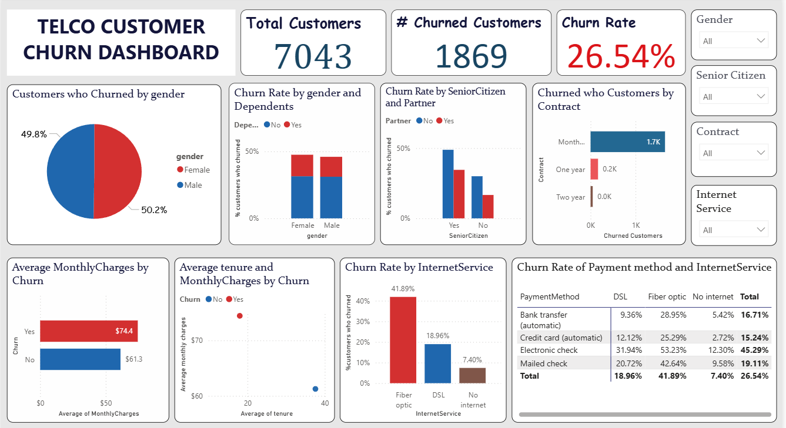
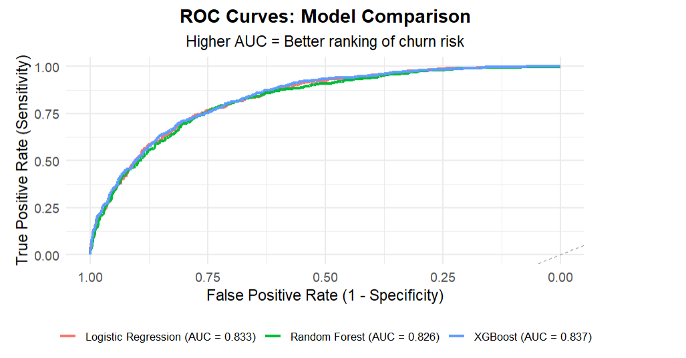

# Telco Customer Churn Prediction

This project explores **customer churn prediction** using machine learning techniques on the [Telco Customer Churn dataset](https://www.kaggle.com/blastchar/telco-customer-churn).  

By predicting which customers are likely to churn, telecom companies can take **proactive retention actions** (discounts, loyalty rewards, better support), ultimately reducing revenue loss.

## 📊 Project Overview
- **Dataset**: Telco Customer Churn data (publicly available on [Kaggle](https://www.kaggle.com/blastchar/telco-customer-churn))
- **Objective**: Predict whether a customer will churn (`Yes`/`No`) and enable retention savings
- **Techniques Used**:
  Data cleaning & preprocessing  
 - Class imbalance with ROSE (synthetic oversampling)  
 - XGBoost, Random Forest, Logistic Regression  
 - Threshold tuning 
 - Model evaluation: confusion matrix, ROC, AUC, F1

## ⚙️ Methodology

### Data Preprocessing
- Cleaned missing values, converted types, trimmed whitespace
- Encoded Yes/No → binary; all categoricals → factors
- Split: 70% train / 30% test
- Applied ROSE to balance training data (26% → ~50% churn)

### 🔹 Modeling
- Trained three models:  
  - Random Forest  
  - Logistic Regression  
  - XGBOOST  
- Tuned classification thresholds:

### Evaluation Metrics
- Accuracy
- Precision, Recall, F1-score
- Accuracy
- Area Under the ROC Curve (AUC)

## ✅ Results
| Model               | Accuracy | Precision | Recall   | F1        | AUC       |
|----------------------|-----------|------------|----------|-----------|-----------|
| Logistic Regression  | 0.7355    | 0.5017     | 0.7825   | 0.6114    | 0.7505    |
| Random Forest        | 0.7445    | 0.5129     | 0.7825   | 0.6196    | 0.7567    |
| XGBoost              | 0.7336    | 0.4994     | 0.8021   | 0.6156    | 0.7555    |

Random Forest wins on F1 (0.620) and AUC (0.757)
XGBoost captures more churners (80.2% recall)  

High-Risk Campaign ImpactFlagged 2,905 customers as high-risk  
1,499 actually churned → 51.6% precision  
30% retention success → 450 saved  
Annual revenue saved: $349,910  
Cost ($100/offer): $290,500  
Net profit: +$59,410  
ROI: +20.5%

📈 PowerBI Dashboard:  

📈 Precision-Recall Curve (Threshold Tuning Example)  

## 📌 Recommendations
Deploy Random Forest for best overall F1 (0.62)  
Use XGBoost if maximizing recall is priority (80% of churners caught)  
Target top 2,905 high-risk customers with:  $100 discount  
Contract upgrade offer  
Personalized support

Prioritize: Month-to-month, fiber optic, electronic check  
Focus on: Seniors & new users (<12 months)  
Retrain quarterly — customer behavior evolves  
Integrate risk score into CRM for real-time alerts 

## 🛠️ Tools & Libraries
- **R Packages**: `caret`, `randomForest`, `dplyr`, `recipes`, `nnet`, `ggplot2`, `pROC`, `themis`
- **Documentation**: R Markdown and Quarto for reporting
- **Visualization**: `ggplot2` for plots (saved in `plots/`)

✨ Author: Mary Ogwo
 

