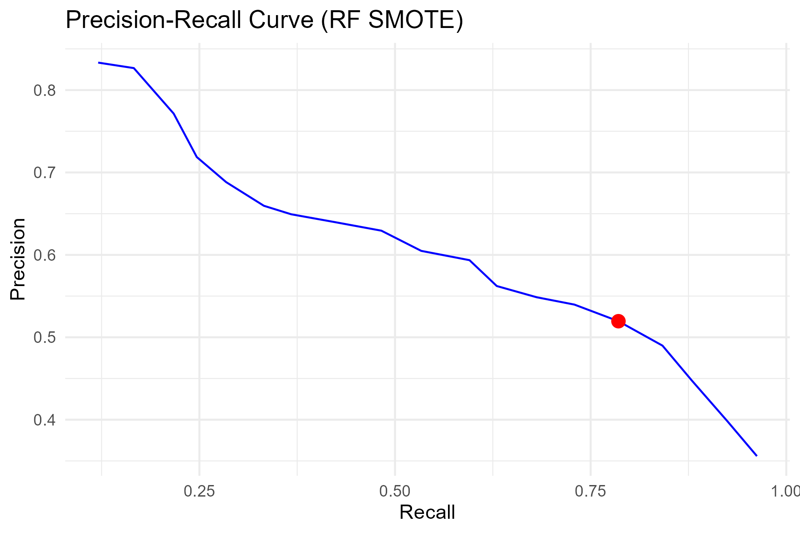

# Telco Customer Churn Prediction

This project explores **customer churn prediction** using machine learning techniques on the [Telco Customer Churn dataset](https://www.kaggle.com/blastchar/telco-customer-churn).  

By predicting which customers are likely to churn, telecom companies can take **proactive retention actions** (discounts, loyalty rewards, better support), ultimately reducing revenue loss.

## 📊 Project Overview
- **Dataset**: Telco Customer Churn data (publicly available on [Kaggle](https://www.kaggle.com/blastchar/telco-customer-churn))
- **Objective**: Predict whether a customer will churn (`Yes`/`No`)
- **Techniques Used**:
  - Data cleaning and preprocessing
  - Handling class imbalance with SMOTE
  - Random Forest, Logistic Regression, and Neural Network classification
  - Threshold tuning for precision-recall tradeoff (F1-based and pROC-based)
  - Model evaluation with confusion matrices, ROC curves, and metrics

## ⚙️ Methodology

### Data Preprocessing
- Handled missing values
- Converted categorical variables to factors and applied dummy encoding
- Split data into 80% training and 20% test sets
- Applied SMOTE to address class imbalance in training data

### 🔹 Modeling
- Trained three models:  
  - Random Forest  
  - Logistic Regression  
  - Neural Network  
- Compared performance **with vs. without SMOTE**
- Tuned classification thresholds:
  - **Precision-Recall curve** → maximize F1-score  
  - **ROC curve (pROC)** → optimize Youden’s J statistic

### Evaluation Metrics
- Accuracy
- Precision, Recall, F1-score
- Balanced Accuracy
- Kappa statistic
- Area Under the ROC Curve (AUC)

## ✅ Results
- **Random Forest with SMOTE** performed best for detecting churn, at the cost of some false positives.  
- Threshold tuning revealed tradeoffs:  
  - **F1-based threshold** → higher recall (captured more churners)  
  - **pROC-based threshold** → balanced recall and specificity  
- Example performance metrics (with threshold tuning, approximate values):
  | Metric            | Value  |
  |-------------------|--------|
  | Accuracy          | ~0.76  |
  | Sensitivity (Recall) | ~0.78 |
  | Specificity       | ~0.72  |
  | Balanced Accuracy | ~0.75  |

📈 Example visualization (Random Forest ROC Curve):  

📈 Precision-Recall Curve (Threshold Tuning Example)  

## 📌 Recommendations
- **Target high-risk customers** (as identified by the model) with tailored retention offers (discounts, loyalty perks, personalized support).  
- **Monitor service quality factors** (tenure, contract type, payment method) since they were strong churn predictors.  
- **Prioritize recall over accuracy** in production → better to flag more potential churners (with some false positives) than miss likely churners.  
- **Retrain models quarterly** as customer behavior and service features evolve.  

## 🛠️ Tools & Libraries
- **R Packages**: `caret`, `randomForest`, `dplyr`, `recipes`, `nnet`, `ggplot2`, `pROC`, `themis`
- **Documentation**: R Markdown and Quarto for reporting
- **Visualization**: `ggplot2` for plots (saved in `plots/`)

✨ Author: Mary Ogwo
 

