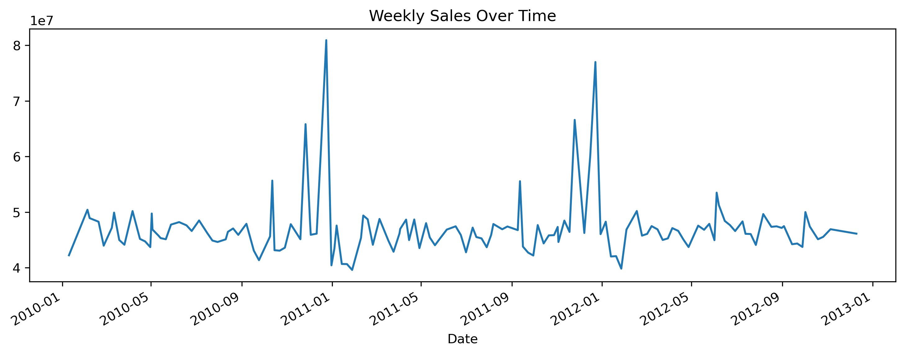
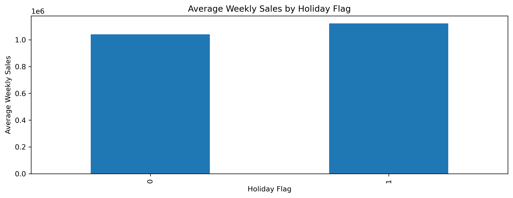
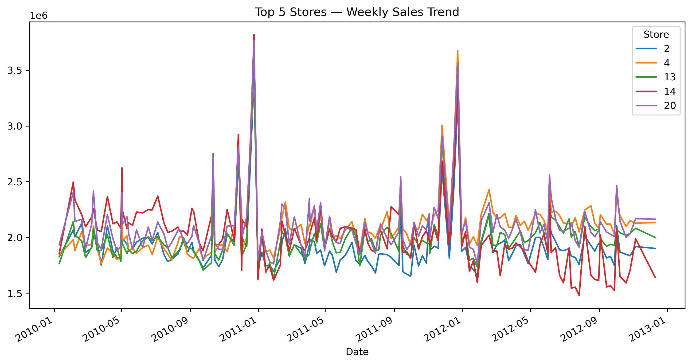
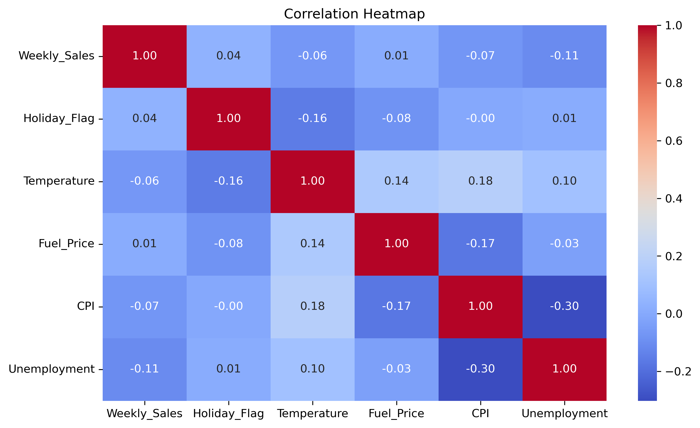
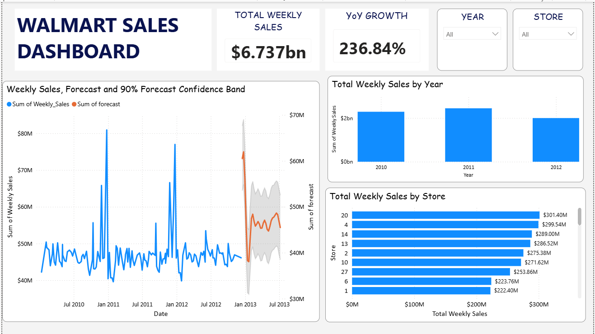

📈 Walmart Weekly Sales Forecasting
Forecasting weekly Walmart sales using time-series analysis and Prophet.
The project explores sales trends, identifies key drivers, and generates future predictions with confidence intervals.

📌 Original dataset: Kaggle – Walmart Weekly Sales
https://www.kaggle.com/datasets/yasserh/walmart-dataset

🔍 Project Overview
The goal of this project is to analyze Walmart’s weekly sales patterns and build a forecasting model capable of predicting future sales along with uncertainty estimates (upper and lower bounds).
This project includes:
- Data cleaning & preparation
- Exploratory time-series analysis
- Mixed-effects regression to identify key drivers of sales
- Forecasting using Prophet with external regressors
- Combining historical + forecasted values
- Power BI dashboard for interactive visualization

🛠️ Tools & Technologies
Python (Pandas, NumPy, Matplotlib, Seaborn, Statsmodels, Prophet, Sklearn)
Jupyter Notebook
Power BI (for final visualization)
GitHub (project documentation and version control)

📈 Key Insights 
- Weekly sales display strong yearly seasonality with noticeable spikes during holiday periods
- Unemployment shows a stronger relationship with sales compared to CPI, fuel price, or temperature.
- Stores show similar trends with some stores showing more stable sales pattern.
- Forecasts suggest moderate variation across stores, captured in the confidence bounds.

📊 Exploratory Analysis
Key steps included:
- Identifying seasonality in weekly sales
- Identifying factors affecting sales
- Visualizing historical trends

Examples of visuals generated during analysis:

🔮 Forecasting Approach

Model Selection:
1. Mixed-Effects Regression Model
- A linear model with fixed store effects was used to determine which external regressors influence sales.
- Allows controlling for inherent differences between stores
- Helps interpret impact of holiday flag, temperature, CPI, fuel price, and unemployment
- R-squared ≈ 0.92, suggesting the features explain a large portion of the variation

2. Prophet Forecasting Model
A Prophet model extended with external regressors was used to generate 30 weeks of forecasts for each store.
Why Prophet?
- Automatically handles seasonality (weekly, yearly)
- Works well with retail patterns
- Accepts regressors to incorporate real-world signals
- Produces upper/lower confidence bounds for uncertainty estimation

Forecast results were exported and merged with historical data in Power BI:

 
🚀 How to Run

1. Clone the repository
   git clone https://github.com/Mayree10/Project.git

2. Install dependencies
   pip install -r requirements.txt

3. Run the notebook
   jupyter notebook walmart_sales_analysis.ipynb
